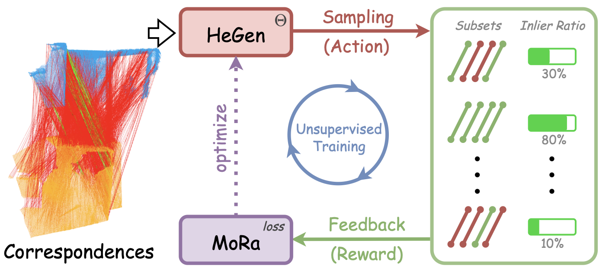








    

🧑‍💻 About Me

- **Master’s Student**, Wuhan University (Advisor: [Jiayuan Li](https://ljy-rs.github.io/web/))  
- **Research**: SLAM, 3D reconstruction, pose estimation, point cloud registration  
- **Focus**: Robotics applications  
- **Contact**: [shaochengyan@whu.edu.cn](mailto:shaochengyan@whu.edu.cn)  
- **Open to collaboration**

# 🔥 News

- *2025.02*:  🎉🎉 Our paper HeMoRa (zh: 赫默拉) is accepted by **<a href="https://cvpr.thecvf.com/Conferences/2025" style="background: linear-gradient(90deg, #007bff, #00cc99, #9933ff); -webkit-background-clip: text; background-clip: text; -webkit-text-fill-color: transparent; font-weight: bold;">CVPR 2025</a>**!
- *2024.11*:  🎉🎉 One paper is accepted by **RA-L 2024**!
- *2024.09*:  🎉🎉 One paper is accepted by TGRS 2024!
- *2024.07*:  🎉🎉 One paper is accepted by **<a href="https://eccv2024.ecva.net/" style="background: linear-gradient(90deg, #007bff, #00cc99, #9933ff); -webkit-background-clip: text; background-clip: text; -webkit-text-fill-color: transparent; font-weight: bold;">ECCV 2024</a>**!
- *2024.07*:  🎉🎉 My homepage is created!

# 📚 Publications 

<!-- HeMoRa -->

CVPR 2025

[HeMoRa: Unsupervised Heuristic Consensus Sampling for Robust Point Cloud Registration]()

**Shaocheng Yan**, [Yiming Wang](https://yimingwangmingle.github.io/bio/), [Kaiyan Zhao](https://kaiyanzhaophoenix.github.io/bio/), [Pengcheng Shi](https://orcid.org/0000-0003-2504-9890), [Zhenjun Zhao](https://ericzzj1989.github.io/), [Yongjun Zhang](https://skyearth.org/zhangyj/), [Jiayuan Li](https://ljy-rs.github.io/web/)

*IEEE/CVF Conference on Computer Vision and Pattern Recognition* (CVPR 2025)

<!-- TCF -->

RA-L 2024

[RANSAC Back to SOTA: A Two-stage Consensus Filtering for Real-time 3D Registration](https://arxiv.org/abs/2410.15682) [[Code](https://github.com/ShiPC-AI/TCF)]

Pengcheng Shi, **Shaocheng Yan**, Yilin Xiao, Xinyi Liu, Yongjun Zhang, Jiayuan Li

*IEEE Robotics and Automation Letters* (RA-L 2024)

<!-- PCSFormer -->

TGRS 2024

[Proxy and Cross-Stripes Integration Transformer for Remote Sensing Image Dehazing](https://ieeexplore.ieee.org/stamp/stamp.jsp?tp=&arnumber=10677537) [[Code](https://github.com/SmileShaun/PCSformer)] [[Hazy-LoveDA Dataset](https://huggingface.co/datasets/SmileShaun/Hazy-LoveDA)] [[Hazy-DIOR Dataset](https://huggingface.co/datasets/SmileShaun/Hazy-DIOR)]

Xiaozhe Zhang, Fengying Xie, Haidong Ding, **Shaocheng Yan**, Zhenwei Shi

*IEEE Transactions on Geoscience and Remote Sensing* (TGRS 2024)

<!-- ML-SemReg -->

ECCV 2024

[ML-SemReg: Boosting Point Cloud Registration with Multi-level Semantic Consistency](https://arxiv.org/pdf/2407.09862) [[Code](https://github.com/Laka-3DV/ML-SemReg)]

**Shaocheng Yan**, Pengcheng Shi, Jiayuan Li

*European Conference on Computer Vision* (ECCV 2024)

 
# 🏆 Honors and Awards

- *2024.11*, **National Second Prize**, China Graduate Mathematical Modeling Contest
- *2022.08*, **National First Prize (Champion)**, China University Robotics Innovation Competition  
- *2020.12*, **First Prize**, 11th National College Student Mathematics Competition (Non-Math Major Category)

# 🎓 Educations
- *2023.09 - Present*, M.S. in Geomatics Engineering, School of Remote Sensing and Information Engineering, Wuhan University
- *2019.09 - 2023.06*, B.S. in Artificial Intelligence, School of Electronic and Information Engineering, Southwest Jiaotong University
