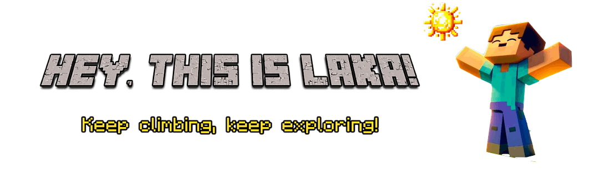
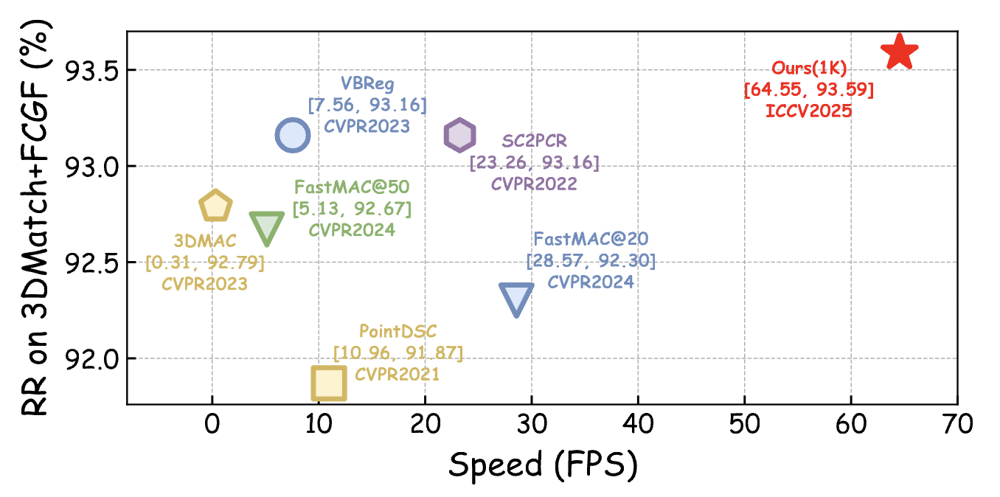
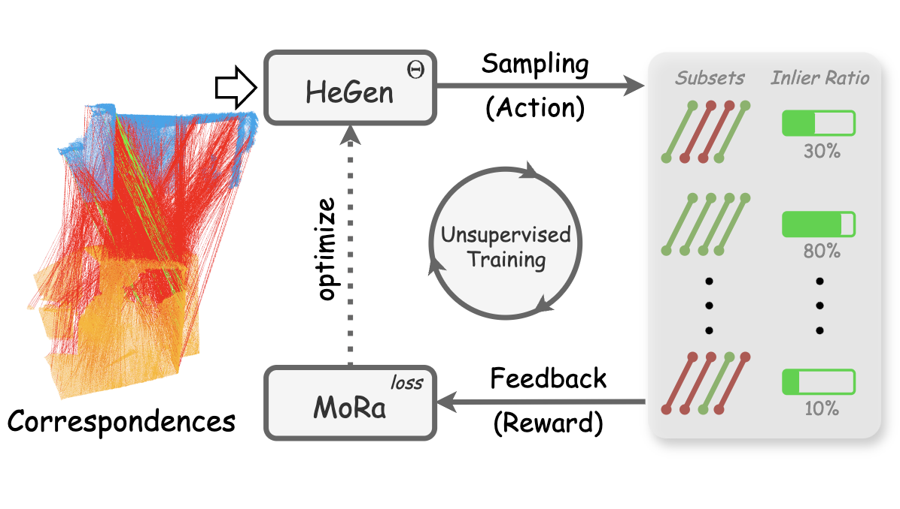
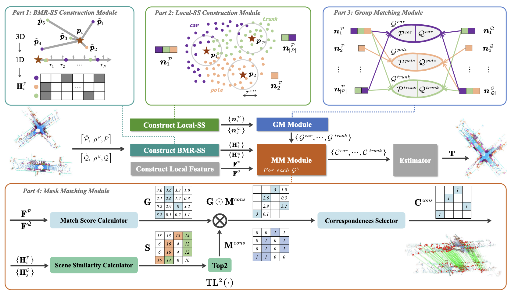
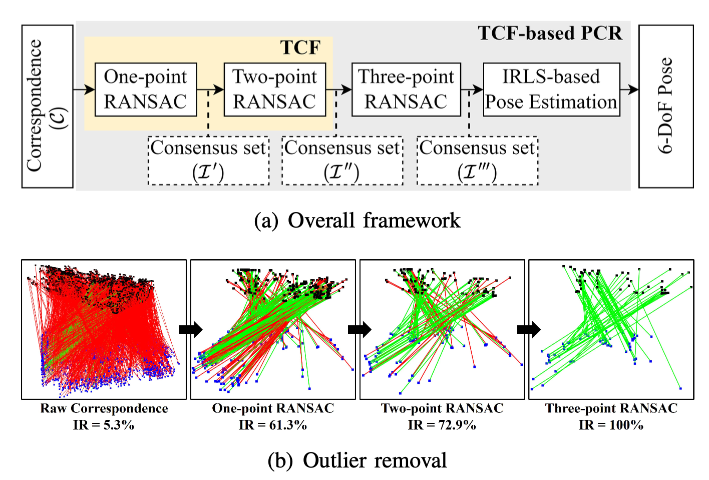
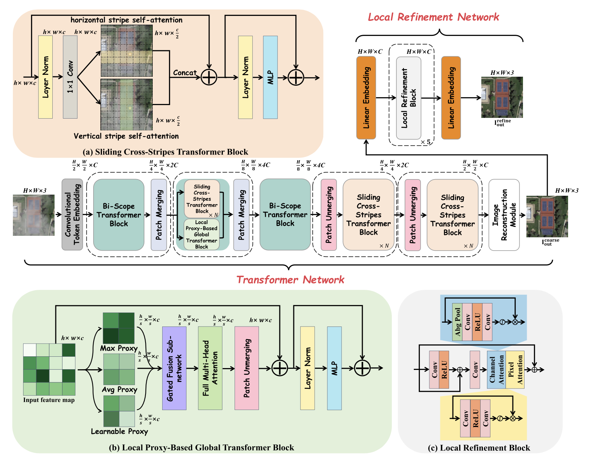








<!-- 

        

 -->

    <!-- <a href="https://github.com/Laka-3DV"> -->
      <!--  -->
      
    <!-- </a> -->

<!-- 

    

 -->

## 🧑‍💻 About Me

- **Master’s Student**, Wuhan University  
- **Advisor**: [Jiayuan Li](https://ljy-rs.github.io/web/)  
- **Research**: Point Cloud Registration, Robust Estimation, Keypoint Matching
<!-- SLAM, 3D reconstruction, -->
<!-- pose estimation -->
- **Contact**: [shaochengyan@whu.edu.cn](mailto:shaochengyan@whu.edu.cn)  
<!-- - **Open to collaboration** -->

> Excited for collaboration opportunities — reach out if you have questions or want to explore!

## 🔥 News

<!-- <ul style="list-style: disc; padding-left: 20px; line-height: 1.5; font-size: 15px;"> -->
<ul style="list-style: disc; padding-left: 30px;">
  <li>
    <strong>2025.08</strong>: 🎉🎉 Invited by <strong>
      <a href="https://space.bilibili.com/483478083" target="_blank" title="3DCVer Bilibili Space">3DCVer</a>
    </strong> to share <strong>TurboReg</strong>!
    Replay on 
    
  </li>
  <li>
    <strong>2025.07</strong>: 🎉🎉 Invited by <strong> 
      <a href="https://space.bilibili.com/45189691" target="_blank" title="3DCVer Bilibili Space">CVlife</a>
    </strong> to share <strong>TurboReg</strong>!
    Replay on 
    
  </li>
  <li>
    <strong>2025.06</strong>: 🎉🎉 Our paper <strong>TurboReg</strong> is accepted by 
    
  </li>
  <li>
    <strong>2025.02</strong>: 🎉🎉 Our paper <strong>HeMoRa</strong> (zh: 赫默拉) is accepted by 
    
  </li>
  <li>
    <strong>2024.11</strong>: 🎉🎉 One paper is accepted by 
    
  </li>
  <li>
    <strong>2024.09</strong>: 🎉🎉 One paper is accepted by 
    
  </li>
  <li>
    <strong>2024.07</strong>: 🎉🎉 One paper is accepted by 
    
  </li>
</ul>

  
Show More

  <ul style="list-style: disc; padding-left: 11.5px;">
    <li>
      <strong>2024.07</strong>: 🎉🎉 My homepage is created!
    </li>
  </ul>

<!-- - *2025.07*: 🎉🎉 Invited by **CVlife** to share **TurboReg**! Replay on <a href="https://www.bilibili.com/video/BV1atbSzJEdv?t=158.1" style="background: linear-gradient(90deg, #007bff, #00cc99, #9933ff); -webkit-background-clip: text; background-clip: text; -webkit-text-fill-color: transparent; font-weight: bold;">Bilibili</a>.
- *2025.06*:  🎉🎉 Our paper **TurboReg** is accepted by **<a href="https://iccv.thecvf.com/" style="background: linear-gradient(90deg, #007bff, #00cc99, #9933ff); -webkit-background-clip: text; background-clip: text; -webkit-text-fill-color: transparent; font-weight: bold;">ICCV 2025</a>**!
- *2025.02*:  🎉🎉 Our paper **HeMoRa** (zh: 赫默拉) is accepted by **<a href="https://cvpr.thecvf.com/Conferences/2025" style="background: linear-gradient(90deg, #007bff, #00cc99, #9933ff); -webkit-background-clip: text; background-clip: text; -webkit-text-fill-color: transparent; font-weight: bold;">CVPR 2025</a>**!
- *2024.11*:  🎉🎉 One paper is accepted by **RA-L 2024**!
- *2024.09*:  🎉🎉 One paper is accepted by TGRS 2024!
- *2024.07*:  🎉🎉 One paper is accepted by **<a href="https://eccv2024.ecva.net/" style="background: linear-gradient(90deg, #007bff, #00cc99, #9933ff); -webkit-background-clip: text; background-clip: text; -webkit-text-fill-color: transparent; font-weight: bold;">ECCV 2024</a>**!
- *2024.07*:  🎉🎉 My homepage is created!
 -->

<!-- ### 📚 Publications  -->
## 🖋️ First-Author Publications

<!-- TurboReg -->
<!-- Image -->

ICCV 2025

<!-- Information -->
<a style="text-decoration: none; color: inherit;">TurboReg:</a>
TurboClique for Robust and Efficient Point Cloud Registration 

**Shaocheng Yan**,
<a href="https://orcid.org/0000-0003-2504-9890" style="text-decoration: none; color: inherit;">Pengcheng Shi</a>,
<a href="https://ericzzj1989.github.io/" style="text-decoration: none; color: inherit;">Zhenjun Zhao</a>,
<a href="https://ericzzj1989.github.io/" style="text-decoration: none; color: inherit;">Kaixin Wang</a>,
<a href="https://ericzzj1989.github.io/" style="text-decoration: none; color: inherit;">Kuang Cao</a>,
<a href="https://ericzzj1989.github.io/" style="text-decoration: none; color: inherit;">Ji Wu</a>,
<a href="https://ljy-rs.github.io/web/" style="text-decoration: none; color: inherit;">Jiayuan Li</a>

**TL;DR:** A highly efficient and robust estimator for point cloud registration (PCR), supporting both CPU and GPU platforms.

<a href="https://iccv.thecvf.com/" style="background: linear-gradient(90deg, #007bff, #00cc99, #9933ff); -webkit-background-clip: text; background-clip: text; -webkit-text-fill-color: transparent; font-weight: bold;">
[ICCV 2025]
</a>International Conference on Computer Vision

<!-- HeMoRa -->
<!-- Image -->

CVPR 2025

<!-- Information -->
<a style="text-decoration: none; color: inherit;">HeMoRa:</a> Unsupervised Heuristic Consensus Sampling for Robust Point Cloud Registration

**Shaocheng Yan**,
<a href="https://yimingwangmingle.github.io/bio/" style="text-decoration: none; color: inherit;">Yiming Wang</a>,
<a href="https://kaiyanzhaophoenix.github.io/bio/" style="text-decoration: none; color: inherit;">Kaiyan Zhao</a>,
<a href="https://orcid.org/0000-0003-2504-9890" style="text-decoration: none; color: inherit;">Pengcheng Shi</a>,
<a href="https://ericzzj1989.github.io/" style="text-decoration: none; color: inherit;">Zhenjun Zhao</a>,
<a href="https://skyearth.org/zhangyj/" style="text-decoration: none; color: inherit;">Yongjun Zhang</a>,
<a href="https://ljy-rs.github.io/web/" style="text-decoration: none; color: inherit;">Jiayuan Li</a>

**TL;DR:** Learning a sampling probability distribution for matches in robust estimation, no supervision and reinforcement-inspired

<!-- [CVPR 2025] 
Computer Vision and Pattern Recognition -->

<a href="https://cvpr.thecvf.com/Conferences/2025" style="background: linear-gradient(90deg, #007bff, #00cc99, #9933ff); -webkit-background-clip: text; background-clip: text; -webkit-text-fill-color: transparent; font-weight: bold;">
[CVPR 2025]
</a>Computer Vision and Pattern Recognition

<!-- 

        #point cloud registration
        #keypoint matching
        #semantic slam

 -->

<!-- ML-SemReg -->

ECCV 2024

<a style="text-decoration: none; color: inherit;">ML-SemReg:</a>
Boosting Point Cloud Registration with Multi-level Semantic Consistency 

**Shaocheng Yan**, 
<a href="https://orcid.org/0000-0003-2504-9890" style="text-decoration: none; color: inherit;">Pengcheng Shi</a>,
<a href="https://ljy-rs.github.io/web/" style="text-decoration: none; color: inherit;">Jiayuan Li</a>

**TL;DR:** Boosting 3D keypoint match recall using semantic labels, no learning needed and SLAM-ready

<!-- [ECCV 2024] European Conference on Computer Vision -->

<a href="https://eccv2024.ecva.net/" style="background: linear-gradient(90deg, #007bff, #00cc99, #9933ff); -webkit-background-clip: text; background-clip: text; -webkit-text-fill-color: transparent; font-weight: bold;">
[ECCV 2024]
</a> European Conference on Computer Vision

## 🧩 Co-Authored Publications

<!-- TCF -->

RA-L 2024

RANSAC Back to SOTA: A Two-stage Consensus Filtering for Real-time 3D Registration 
[[PDF](https://arxiv.org/abs/2410.15682)] [[Code](https://github.com/ShiPC-AI/TCF)]

Pengcheng Shi, **Shaocheng Yan**, Yilin Xiao, Xinyi Liu, Yongjun Zhang, Jiayuan Li

[RA-L 2024] IEEE Robotics and Automation Letters

<!-- PCSFormer -->

TGRS 2024

Proxy and Cross-Stripes Integration Transformer for Remote Sensing Image Dehazing [[PDF](https://ieeexplore.ieee.org/stamp/stamp.jsp?tp=&arnumber=10677537)] [[Code](https://github.com/SmileShaun/PCSformer)] [[Hazy-LoveDA Dataset](https://huggingface.co/datasets/SmileShaun/Hazy-LoveDA)] [[Hazy-DIOR Dataset](https://huggingface.co/datasets/SmileShaun/Hazy-DIOR)]

Xiaozhe Zhang, Fengying Xie, Haidong Ding, **Shaocheng Yan**, Zhenwei Shi

[TGRS 2024]
IEEE Transactions on Geoscience and Remote Sensing

 
## 🏆 Honors and Awards

- *2025.04*, **Outstanding Graduate**, Class of 2025  
- *2024.11*, **National Second Prize**, China Graduate Mathematical Modeling Contest
- *2022.08*, **National First Prize (Champion)**, China University Robotics Innovation Competition  
- *2020.12*, **First Prize**, 11th National College Student Mathematics Competition (Non-Math Major Category)

## 🎓 Educations
- *2023.09 - Present*, M.S. in Geomatics Engineering, School of Remote Sensing and Information Engineering, Wuhan University
- *2019.09 - 2023.06*, B.S. in Artificial Intelligence, School of Electronic and Information Engineering, Southwest Jiaotong University